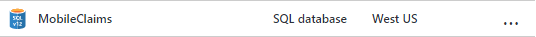
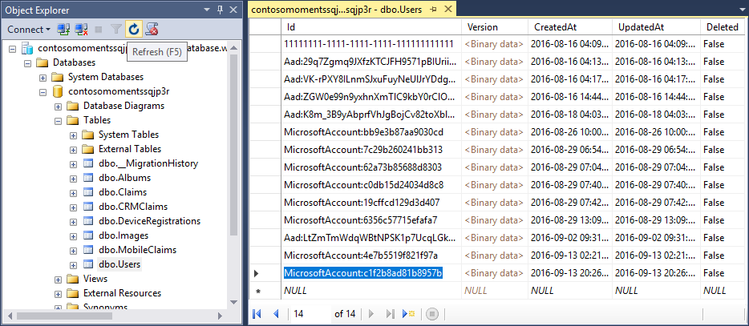
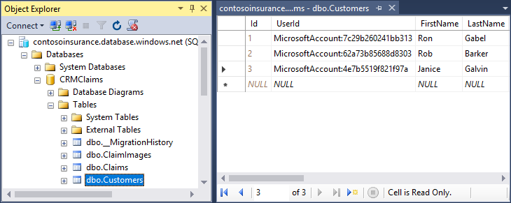
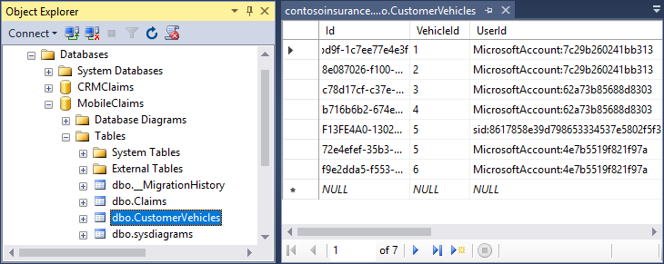

# Contoso Insurance - Azure App Services Code Sample #

## What is Contoso Insurance? ##
Contoso Insurance is a sample that demonstrates the advantages of using the Azure App Service for building Modern Applications.  It demonstrates using the following Azure App Services features.

- App Service authentication/authorization
- Continuous integration and deployment
- Mobile app server SDK
- Mobile offline sync client SDK
- Mobile file sync SDK
- Logic Apps
	- Invoking Azure Functions via web hooks
	- Sending Email
- Azure Functions
	- Web hook triggers
	- Queue triggers
- Azure Cognitive Services - Computer Vision API

The sample also demonstrates how to use other technologies including:

- ASP.NET MVC Web Site with Knockout
- ASP.NET MVC Web API
- Xamarin Forms Mobile Application
- Azure Application Insights
- Azure PAAS SQL Databases
- Entity Framework
- Azure Storage Accounts
	- Queues
	- Blobs
- Extension methods
- Custom Attributes

## Documentation ##

**Scenario Flow Documentation**

See the [Contoso Insurance Visio Document](/Contoso Insurance.vsdx) for an end to end picture of the flow of the entire scenario and the components used all along the way.

**Technical Documentation**

See the [Azure Components document](/Azure Components.docx) for a complete and detailed description of all of the components that implement this sample.  This document includes:

- Components list
- Logic Apps Diagrams
- Mobile Claims SQL Database Schema and description
- CRM Claims SQL Database Schema and description
- Application Insights Status Logging Matrix
- User Matrix
- Email Matrix
- How to add new customer users 

## How To: Configure your Development Environment ##

Download and install the following tools to build and/or develop this application locally.

- [Visual Studio 2015 Community](https://go.microsoft.com/fwlink/?LinkId=691978&clcid=0x409)
- [Xamarin Platform for Visual Studio](https://xamarin.com/platform)

**Create an Computer Vision Account**

1. Open https://www.microsoft.com/cognitive-services/en-us/sign-up in your web browser.
1. Click **Let's Go**
1. Sign in
1. Select the **Computer Vision - Preview** check box
1. Select the **I agree to the Microsoft Cognitive Services Terms and Microsoft Privacy Statement** check box
1. Click **Subscribe**
1. Copy the Computer Vision Services keys and save them in a text file.  

>**Note:** You will need one of the Computer Vision Services keys in a subsequent step.

**Deploy the Azure Components**

1. Check to ensure that the build is passing VSTS Build
2. Fork this repository to your GitHub account
3. Click the Deploy to Azure Button

	[](https://portal.azure.com/#create/Microsoft.Template/uri/https%3a%2f%2fraw.githubusercontent.com%2fTylerLu%2fContosoInsurance%2fmaster%2fSrc%2fazuredeploy.json)

4. Fill in the values in the deployment page.

	

	* **Resource group**: To reduce failures, please use a new Resource Group.

	* **SITENAME**: Use the default value. The first 6 characters of the Resource Group Id will be appended to the site name to avoid name duplication errors.

	* **SQLADMINISTRATORLOGINPASSWORD**: **DO** use a strong password.

	* **SOURCECODEREPOSITORYURL**: Use the repository you just forked.

	* **SOURCECODEMANUALINTEGRATION** : If deploying from the main repo, use true for ManualIntegration, otherwise use false. This parameter controls whether or not a webhook is created when you deploy. If you don't have permissions to the repo and it tries to create a webhook (i.e., ManualIntegration is false, then deployment will fail).

		>**IMPORTANT Note:**: If you set this value to false then **YOU MUST** follow the steps in the GitHub Authorization section in this document befoe you click the Create button to deploy the Azure components.

	* **VISIONSERVICESUBSCRIPTIONKEY**: Use one of the Computer Vision Services keys you just created.
	
5. Click **OK**.

6. Click **Review Legal terms**, then click **Purchase**.

7. Click **Create**.

	>**Notes:** 
	>- The deployment creates a Basic (B1) hosting plan in Azure where all of the components are deployed.
	>- The deployment process takes about 8 minutes.

	>- When the deployment steps complete, you will see the following Azure components in the Resource Group.

	> 

**Update the Contoso_ClaimAutoApproverUrl App Setting in the Function App**
	
1. Get the Url for the ClaimAutoApprover Logic App  :	

	

	

1. Update the **Contoso_ClaimAutoApproverUrl** App Setting for the Function App:

		
	
	

**Initialize databases with sample data**

1. Execute the **/Cloud/InitMobileClaims.sql** SQL script against the MobileClaims database.
	
	
 
2. Execute the **/Cloud/InitCRMClaims.sql** SQL script against the CRMClaims database. 

	

**Initialize the Storage Account with sample images**

1. Get the name and key of the Storage Account.

	
		
	

1. Execute the **/Cloud/InitStorage.ps1** PowerShell script. 

	>**Note:** Use the *Storage Account Name* and *Storage Account Key* associated with your Storage Account.

	```PowerShell
	./InitStorage.ps1 <<Your Storage Account Name>> <<Your Storage Account Key>>
	```

**Populate demo data**

1. Execute the **/Cloud/Demo Data/MobileClaims.sql** SQL Script against the MobileClaims database. 
		
	
 
1. Update the Storage Account Name in the **/Src/Cloud/Demo Data/CRMClaims.sql** SQL script.
		
	

	```sql
	DECLARE @imageUrlBase nvarchar(255) = 'https://<Your Storage Account Name>.blob.core.windows.net/vehicle-images/vehicle-';
	```	

	For example:

	If your storage account name is contosoinsurancestorage then the updated value will look like this:

	```sql	
	DECLARE @imageUrlBase nvarchar(255) = 'https://contosoinsurancestorage.blob.core.windows.net/vehicle-images/vehicle-';
	```

1. Execute the **/Cloud/Demo Data/CRMClaims.sql** SQL script against the CRMClaims database. 
	
	
	
**Upload vehicle images to the storage account**

1. Execute the **/Cloud/Demo Data/UploadVehicleImages.ps1** PowerShell script. 

	

	```PowerShell
	./UploadVehicleImages.ps1 <<Your Storage Account Name>> <<Your Storage Account Key>>
	```

	>**Note:** Use the *Storage Account Name* and *Storage Account Key* associated with your Storage Account.

**Configure Authentications**

1. Configure the API App to use Microsoft Authentication

	

	Follow the steps in this article: [How to configure your App Service application to use Microsoft Account login](https://azure.microsoft.com/en-us/documentation/articles/app-service-mobile-how-to-configure-microsoft-authentication/)
		
	

	>**IMPORTANT Note:** Ensure that the Action to take when a request is not authenticated is set to **Allow request (no action)**.  This is shown in the screenshot above.

2. Configure the Web App to use AAD Authentication.
	
	

	Follow the steps in the **Manually configure Azure Active Directory with advanced settings** section in this article: [How to configure your App Service application to use Azure Active Directory login](https://azure.microsoft.com/en-us/documentation/articles/app-service-mobile-how-to-configure-active-directory-authentication/)

	

	>**IMPORTANT Note:** Ensure that the Action to take when a request is not authenticated is set to **Log in with Azure Active Directory**.  This is shown in the screenshot above.

**Authenticate the Office 365 API Connection**
	
1. Open the **API Connection**.	

	

1. Click the **orange alert**.

	

1. Click **Authorize**:
	
	

1. Sign in with your Office 365 account.
	
	

1. Click **Save**.

	

## Create Customer User Accounts ##

User account creation is not completely automated yet in this sample.  Therefore, there are a few steps you need to do to register the customer user accounts in the databases so they work with the sample data.  The customer user accounts are Microsoft Accounts and are used to sign into the mobile app.  Only one customer account is required to run the code sample, although the SQL and PowerShell scripts you ran in previous steps provisioned sample data for 2 customer accounts (in the event you want to make more than one).

**Create Microsoft Account**

1. Go to https://www.outlook.com and create a Microsoft Account.

**Get User Id for the Microsoft Account** 

1. Install the [Contoso Moments Azure Web App](https://github.com/azure-appservice-samples/ContosoMoments)
1. Login to the Contoso Moments Azure Web App with the Microsoft Account.
1. Open the database associated with the Contoso Moments Web App and copy the **Id** from the **Users** table.

	

1. Connect to the **CRMClaims** database and open the **Customers** table.

	 
	
	

1. Replace the **UserId** column for one of the rows with the Id for the Microsoft Account.  
>**IMPORTANT Note:** Make a note of which *UserId* you replaced, you will need it to complete the steps below.
1. In the same row, replace the **Email** column with the email address for the Microsoft Account.
1. Connect to the **MobileClaims** database and open the **CustomerVehicles** table.
	
	 
	
	

1. Find the rows that match the UserId you replaced, there are two of them for each customer.  Use the UserId you made a note of in the steps above to find the matching rows.
1. **In both matching rows**, replace the **UserId** columns with the Id for the Microsoft Account.

## How To: Run the mobile client app for local execution and debugging on the iOS simulator##

>**Note:** Currently, only the iOS version of the mobile app is fully implemented.  The Android version of the app is a prototype and is not fully implemented. 

1. Use Visual Studio 2015 to open the **src/Cloud/ContosoInsurance-Cloud.sln** Visual Studio Solution file.
1.	Set up your Mac computer to act as a remote build machine.
	1.	Click the **Tools** menu and select **Options**.
	1.	Click **Xamarin**.
	1.	Click **iOS Settings**.
	1.	Click **Find Xamarin Mac Agent** and follow the wizard to connect your Mac.
	1.	Click **OK**.
1.  Configure the debugging target device according to the screenshot below.

	
1.   Press **F5**.
1.   Observe the iOS Simulator start on the Mac Agent and load the Contoso Insurance mobile app.

## How To: Install the web application for local execution and debugging ##
 
1. Use Visual Studio 2015 to open the **src/Cloud/ContosoInsurance-Cloud.sln** Visual Studio Solution file.
1.   Right click the **ContosoInsurance.Web** project and select **Set as StartUp Project**.  
1.   Press **F5**.
1.   Observe the web browser open and load the Contoso Insurance claims search page.

## How To: View the custom events and metrics in Application Insights to monitor and debug the application

The sample logs status information and exceptions to Application Insights for every step in the process.  This starts moment they are received from the mobile app and continues until the very end when a claim is manually approved or rejected by the claims adjuster.

To view the custom events and metrics in Application Insights follow these steps.

1.  Open https://portal.azure.com in a web browser and log in.
1.  Click the Application Insights link in the left menu.
1.	Click the contosoinsurance Application Insights application that was created when you deployed all the components.
1.	Click Search.

	

1.	Observe all of the Custom Events.

	

1.	Click a Custom Event in the list to see the metrics logged for the event.
	
	>**Note:**  You can refer to the Application Insights Logging Matrix in the [Azure Components document](/Azure Components.docx) to see all of the Custom Metrics logged for each Custom Event.  In the example below you can see this custom event was written by the HandleNewClaim Azure Function when it invoked the ClaimAutoApprover Azure Function.

	

**Track an individual claim**

Each claim has a CorrelationId associated with it.  You can see this in the screenshot above.  The CorrelationId is used to track the claims from the moment they are received from the mobile app until the end of the process.  You can track the flow of a single claim through the Azure components and the web application by using the CorrelationId.  Here's how to do it:

1.  Copy the CorrelationId from a Custom Event.
2.  Click **Search**.

	

2.	Paste the CorrelationId into the **Search textbox** and observe all the Custom Events associated with the CorrelationId.

	>**Note:**  This is an excellent way to debug errors in the system and is also especially helpful to determine how long a given step takes to execute.  This sample typically processes claims from the point where they are submitted in the mobile app to the point where they are ready for manual approval in 15 seconds when running the sample on the most basic App Services service level!
	
	 

**Track an individual claim with Application Insights Analytics**

In addition to viewing all the Custom Events associated with a CorrelationId in the Application Insights Search interface, you can use Application Insights Analytics to track an individual claim.

Here is the query to run in Application Insights Analytics to track an individual claim's CorrelationId.

```
customEvents
    | where customDimensions.CorrelationId =~ "<YOUR CORRELATION ID>"
    | project timestamp, customDimensions.LogType, name, customMeasurements, customMeasurements.Host, customDimensions.Description, customDimensions.FunctionName, customDimensions.Status, customDimensions.Version
| order by timestamp asc
```
As you can see below, this claim took 22 seconds to process.


## GitHub Authorization ##

**Generate Token**

1. Open https://github.com/settings/tokens in your web browser.
2. Sign into your GitHub account where you forked this repository.
3. Click **Generate Token**
4. Enter a value in the **Token description** text box
5. Select all the **check boxes**

	

6. Click **Generate token**
7. Copy the token

**Add the GitHub Token to Azure in the Azure Resource Explorer**

1. Open https://resources.azure.com/providers/Microsoft.Web/sourcecontrols/GitHub in your web browser.
2. Log in with your Azure account.
3. Selected the correct Azure subscription.
4. Select **Read/Write** mode.
5. Click **Edit**.
6. Paste the token into the **token parameter**.
	
7. Click **PUT**

## Contributors
Roles|Author(s)
--------|---------
Project Lead / Architect / Documentation |Todd Baginski (Microsoft MVP, Canviz Consulting) @tbag
Mobile Apps | Cloris Sun (Canviz Consulting)
Web Apps | Albert Xie (Canviz Consulting)
Azure Components, Services, Deployment | Tyler Lu (Canviz Consulting) @TylerLu
Testing | Ring Li (Canviz Consulting)
Testing | Melody She (Canviz Consulting)
UX Design | Justin So (Canviz Consulting)
PM | Johnny Chu (Canviz Consulting) @johnathanchu
PM | Arthur Zheng (Canviz Consulting)
Sponsor / Support | Donna Malayeri (Microsoft) @lindydonna
Sponsor / Support | Cory Fowler (Microsoft) @SyntaxC4-MSFT
Sponsor / Support | Jeremy Thake (Microsoft) @jthake
Sponsor / Support | Jeff Hollan (Microsoft) @jeffhollan
Sponsor / Support | Yochay Kiriaty (Microsoft) @yochay
Sponsor / Support | Fabio Kavalcante (Microsoft)
Sponsor / Support | Chris Gillum (Microsoft) @cgillum

## Version history

Version|Date|Comments
-------|----|--------
1.0|Sept 26, 2016|Initial release

## Disclaimer
**THIS CODE IS PROVIDED *AS IS* WITHOUT WARRANTY OF ANY KIND, EITHER EXPRESS OR IMPLIED, INCLUDING ANY IMPLIED WARRANTIES OF FITNESS FOR A PARTICULAR PURPOSE, MERCHANTABILITY, OR NON-INFRINGEMENT.**
