# Contoso Insurance - Azure App Services Code Sample #

## What is Contoso Insurance? ##
Contoso Insurance is a sample that demonstrates the advantages of using the Azure App Service for building Modern Applications.  It demonstrates using the following Azure App Services features.

- App Service authentication/authorization
- Continuous integration and deployment
- Mobile app server SDK
- Mobile offline sync client SDK
- Mobile file sync SDK
- Logic Apps
  - Invoking Azure Functions via web hooks
  - Sending Email
- Azure Functions
  - Web hook triggers
  - Queue triggers
- Azure Cognitive Services - Computer Vision API
- ARM Templates
- Notification Hubs
  - Push Notifications to mobile devices

The sample also demonstrates how to use other technologies including:

- ASP.NET MVC Web Site with Knockout
- ASP.NET MVC Web API
- Xamarin Forms Mobile Application
  - iOS
  - Android 
- Azure Application Insights
- HockeyApp
- Azure PaaS SQL Databases
- Entity Framework
- Azure Storage Accounts
  - Queues
  - Blobs
- Extension methods
- Custom Attributes

## Documentation ##

**Scenario Flow Documentation**

See the [Contoso Insurance Visio Document](/Contoso Insurance.vsdx) for an end to end picture of the flow of the entire scenario and the components used all along the way.

**Technical Documentation**

See the [Azure Components document](/Azure Components.docx) for a complete and detailed description of all of the components that implement this sample.  This document includes:

- Components list
- Logic Apps Diagrams
- Mobile Claims SQL Database Schema and description
- CRM Claims SQL Database Schema and description
- Application Insights Status Logging Matrix
- User Matrix
- Email Matrix
- How to add new customer users 

## How To: Configure your Development Environment ##

Download and install the following tools to run, build and/or develop this application locally.

- [Visual Studio 2015 Community](https://go.microsoft.com/fwlink/?LinkId=691978&clcid=0x409)
- [Xamarin Platform for Visual Studio](https://xamarin.com/platform) 

  > **Note:** You must install the Xamarin Platform to run the mobile app.

**GitHub Authorization**

1.  Generate Token

    * Open https://github.com/settings/tokens in your web browser.
    * Sign into your GitHub account where you forked this repository.
    * Click **Generate Token**
    * Enter a value in the **Token description** text box
    * Select all the **check boxes**

    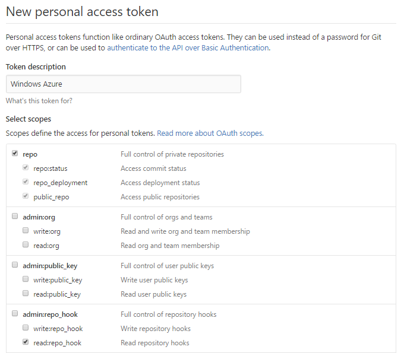

    * Click **Generate token**
    * Copy the token

2.  Add the GitHub Token to Azure in the Azure Resource Explorer

    * Open https://resources.azure.com/providers/Microsoft.Web/sourcecontrols/GitHub in your web browser.
    * Log in with your Azure account.
    * Selected the correct Azure subscription.
    * Select **Read/Write** mode.
    * Click **Edit**.
    * Paste the token into the **token parameter**.

    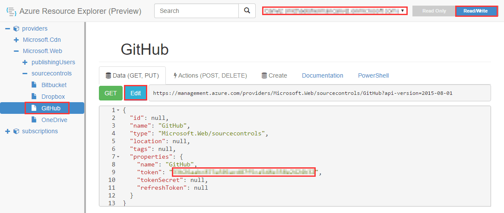

    * Click **PUT**

**Create a Computer Vision Account**

1. Open https://www.microsoft.com/cognitive-services/en-us/sign-up in your web browser.
2. Click **Let's Go**
3. Sign in
4. Select the **Computer Vision - Preview** check box
5. Select the **I agree to the Microsoft Cognitive Services Terms and Microsoft Privacy Statement** check box
6. Click **Subscribe**
7. Copy the Computer Vision Services keys and save them in a text file.  

>**Note:** You will need one of the Computer Vision Services keys in a subsequent step

**Deploy the Azure Components**

1. Check to ensure that the build is passing VSTS Build
2. Fork this repository to your GitHub account
3. Click the Deploy to Azure Button

   [](https://portal.azure.com/#create/Microsoft.Template/uri/https%3a%2f%2fraw.githubusercontent.com%2fTylerLu%2fContosoInsurance%2fmaster%2fSrc%2fazuredeploy.json)

4. Fill in the values in the deployment page.

   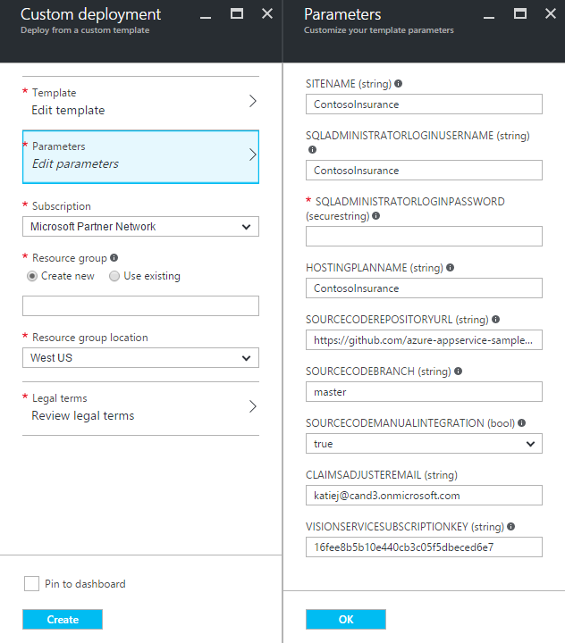

   * **Resource group**: To reduce failures, please use a new Resource Group.

   * **SITENAME**: Use the default value. The first 6 characters of the Resource Group Id will be appended to the site name to avoid name duplication errors.

   * **SQLADMINISTRATORLOGINPASSWORD**: **DO** use a strong password.

   * **SOURCECODEREPOSITORYURL**: Use the repository you just forked.

   * **SOURCECODEMANUALINTEGRATION** : If deploying from the main repo, use true for ManualIntegration, otherwise use false. This parameter controls whether or not a webhook is created when you deploy. If you don't have permissions to the repo and it tries to create a webhook (i.e., ManualIntegration is false, then deployment will fail).

     >**IMPORTANT Note:** If you set this value to false then **YOU MUST** follow the steps in the GitHub Authorization section in this document before you click the Create button to deploy the Azure components.

   * **CLAIMSADJUSTEREMAIL**: Use an Office 365 Organization Account email address for this setting value.  

     >**IMPORTANT Notes:**
     >* **This account must be a user in the Azure Active Directory associated with the Azure Subscription where you deploy the sample.**  
     >* **This account must also have an Office 365 license granted to it and an Exchange mailbox created so it can send and receive emails.**  
     >* You will log into the web application with this account to play the role of the claims adjuster.

   * **VISIONSERVICESUBSCRIPTIONKEY**: Use one of the Computer Vision Services keys you just created.

5. Click **OK**.

6. Click **Review Legal terms**, then click **Purchase**.

7. Click **Create**.

   >**Notes:** 
   >- The deployment creates a Basic (B1) hosting plan in Azure where all of the components are deployed.
   >- The deployment process takes about 8 minutes.

   >- When the deployment steps complete, you will see the following Azure components in the Resource Group.

   > 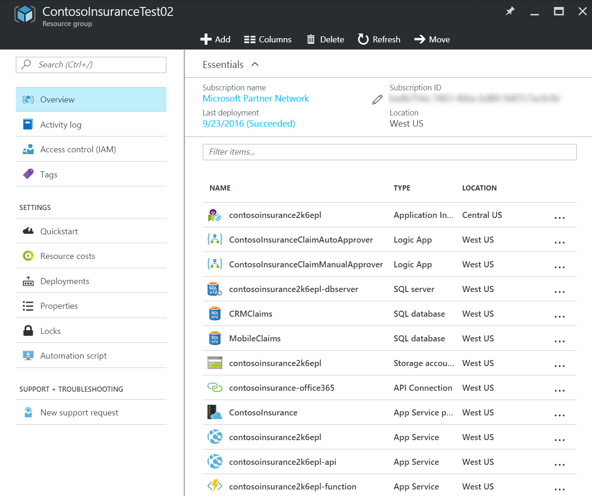

**Update the Contoso_ClaimAutoApproverUrl App Setting in the Function App**
​	
1. In the list of components in the Resource Group the ARM template created (pictured above), click the **ContosoInsuranceClaimAutoApprover Logic App**.

   

2. Scroll to the bottom of the blade on the right side of the screen.
3. In the **All triggers** section, click the **manual** link.
   1. In the manual blade, mouse over the **Callback url** and select **Click to copy**.

   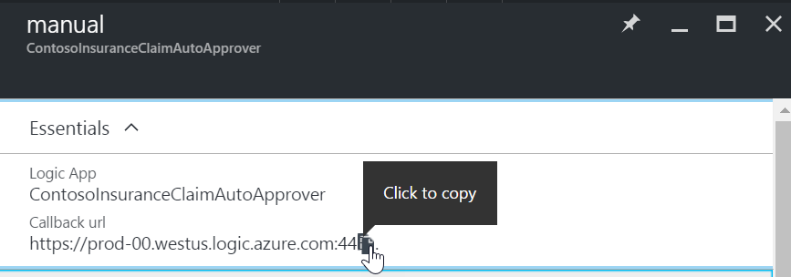

4. In the list of components in the Resource Group the ARM template created (pictured above), click the **Function App**.

   

5. Click the **Function app settings** link

   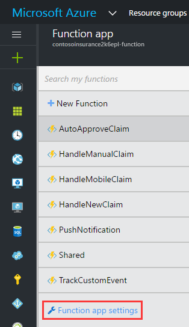

6. Click the **Configure app settings** button

   

7. Paste the Callback Url you copied from the ContosoInsuranceClaimAutoApprover Logic App into the **Contoso_ClaimAutoApproverUrl** App Setting.

   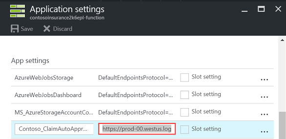

   >**Note:**  If you deploy the Function App again with the ARM template then you will have to manually set  the **Contoso_ClaimAutoApproverUrl** App Setting again.

**Configure Authentication For Web Apps**

1. Configure the API App to use Microsoft Authentication

   

   >**Note:** Step 1 in the article below tells you to copy the Url for your web app.  To copy the URL for your web app click the API **App Service** in the list of components in the Resource Group the ARM template created (pictured above).  Then, mouse over the **URL** and select **Click to copy**.
   >
   >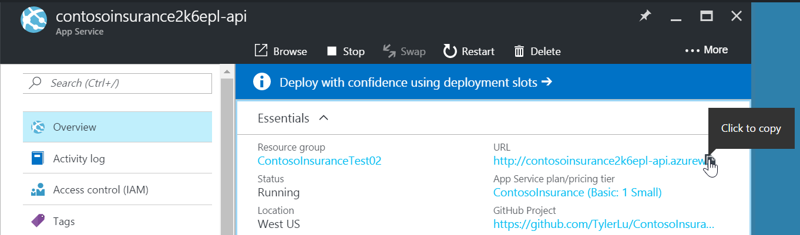

   Follow the steps in this article: [How to configure your App Service application to use Microsoft Account login](https://azure.microsoft.com/en-us/documentation/articles/app-service-mobile-how-to-configure-microsoft-authentication/)
   ​	
   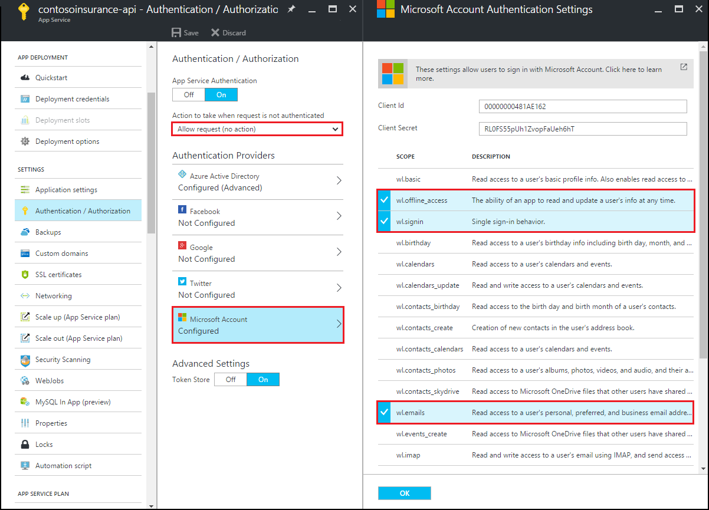

   >**IMPORTANT Note:** Ensure that the Action to take when a request is not authenticated is set to **Allow request (no action)**.  This is shown in the screenshot above.

   >**IMPORTANT Note:** Ensure that **wl.offline_access**, **wl.signin** and **wl.emails** are selected.  This is shown in the screenshot above.	

2. Configure the Web App to use AAD Authentication.

   

   If the Express configuration does not work, follow the steps in the **Manually configure Azure Active Directory with advanced settings** section in this article: [How to configure your App Service application to use Azure Active Directory login](https://azure.microsoft.com/en-us/documentation/articles/app-service-mobile-how-to-configure-active-directory-authentication/)

   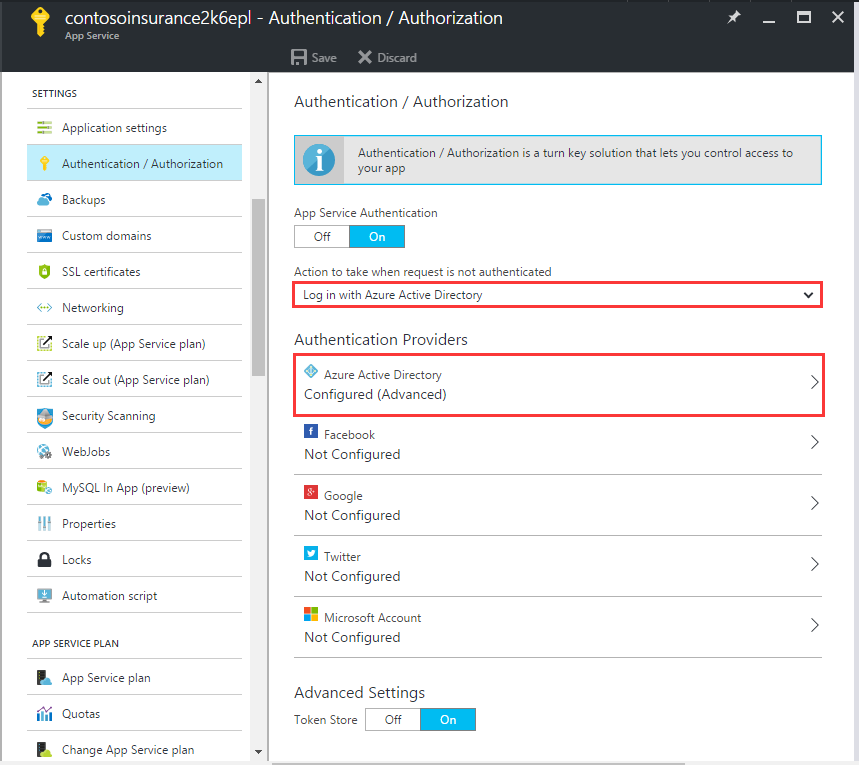

   >**IMPORTANT Note:** Ensure that the Action to take when a request is not authenticated is set to **Log in with Azure Active Directory**.  This is shown in the screenshot above.

**Authenticate the Office 365 API Connection**

The Logic App uses an Office 365 API Connection to send email.  To authorize the Logic App to call the Office 365 API and send email, follow these steps.
​	
1. Open the **API Connection**.	

   

2. Click the **orange alert**.

   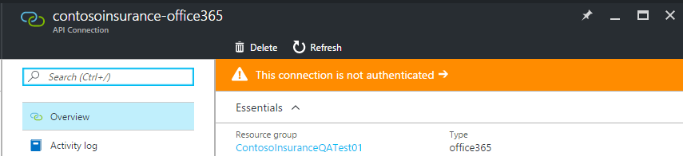

3. Click **Authorize**:

   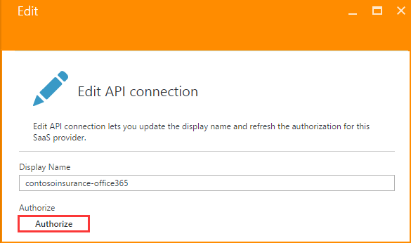

4. Sign in with your Office 365 account.

   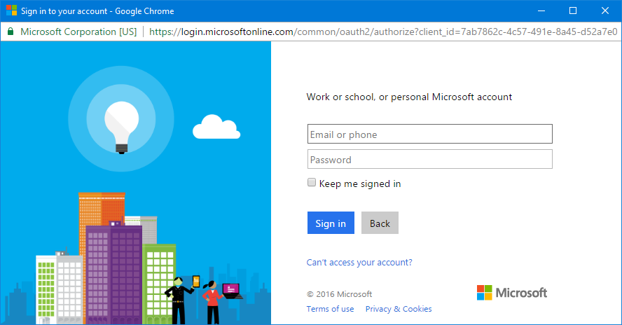

5. Click **Save**.

   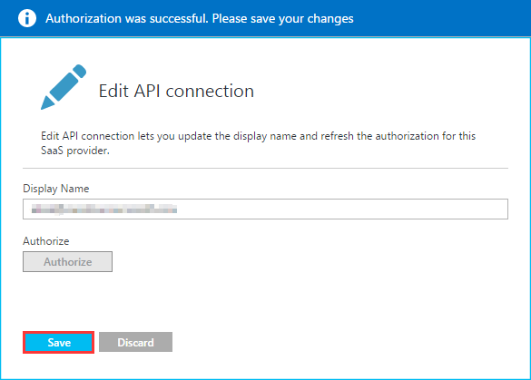

**Configure Notification Hub**

1. Open the Notification Hub.

   

2. Click **All Settings**, then click **Notification Services**.

   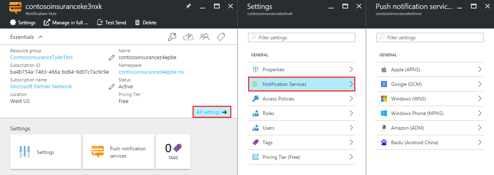

3. Configure **Google (GCM)**.

   For this step, you need a [Google account](https://accounts.google.com/SignUp) with a verified email address.

   * Log in to the [Firebase console](https://firebase.google.com/console/). Create a new Firebase project if you don't already have one.

   * After your project is created click **Add Firebase to your Android app** and follow the instructions provided.

     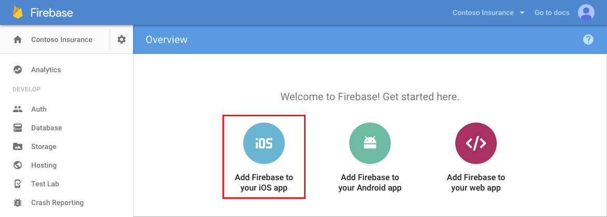			

   * Click the **cog**, then click **Project Settings** -> **CLOUD MESSAGING**.

     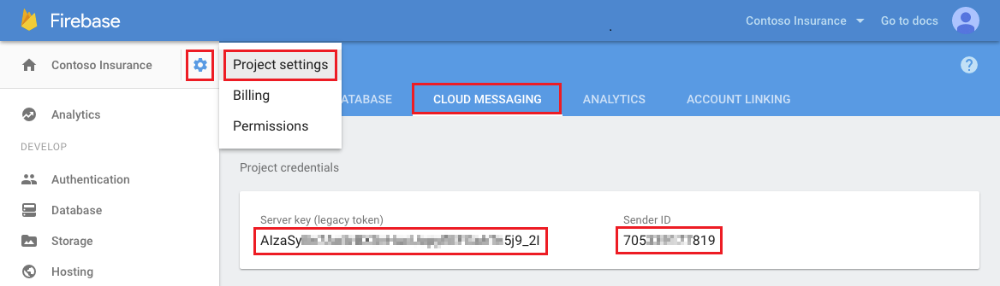

     If the page says "Your project doesn't have a server key", click **Regenerate Key**.

     Copy the **Server key (legacy token)**. 

     > **Note**: The **Sender ID** will be used on the **Settings** page of the Android App.

     > 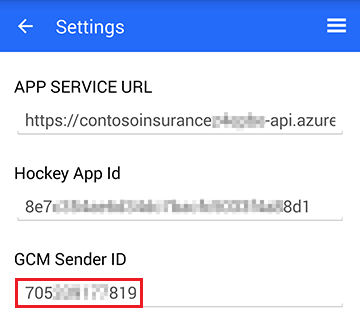

   * Paste the server key to the **API Key** input box below.

     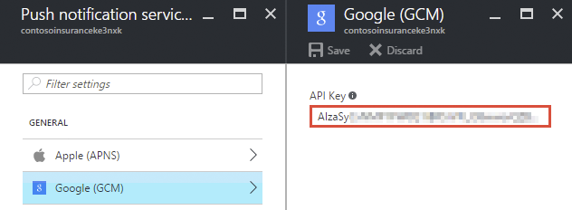

     Click **Save**.

4. Configure **Apple (APNS)**:

   The [iOS simulator does not support push notifications](https://developer.apple.com/library/ios/documentation/IDEs/Conceptual/iOS_Simulator_Guide/TestingontheiOSSimulator.html), so for this step, you need a physical iOS device and an [Apple Developer Program membership](https://developer.apple.com/programs/ios/).

   - [Register an App ID for your app](https://developer.apple.com/library/ios/documentation/IDEs/Conceptual/AppDistributionGuide/MaintainingProfiles/MaintainingProfiles.html#//apple_ref/doc/uid/TP40012582-CH30-SW991). Create an explicit App ID (not a wildcard App ID) and for Bundle ID, use the exact Bundle ID that is in your iOS project. It is also crucial that you check the Push Notifications option.

   - Next, [configure push notifications](https://developer.apple.com/library/ios/documentation/IDEs/Conceptual/AppDistributionGuide/AddingCapabilities/AddingCapabilities.html#//apple_ref/doc/uid/TP40012582-CH26-SW6). You may create either a "Development" or "Distribution" SSL certificate.

   - On your Mac, launch **Keychain Access**. Open **Category** > **My Certificates**. Find the SSL certificate to export (that you downloaded earlier) and disclose its contents. Select only the certificate without selecting the private key, and [export it](https://support.apple.com/kb/PH20122?locale=en_US).

   - Click **Upload Certificate**. Upload the .p12 push certificate file you exported earlier. 

     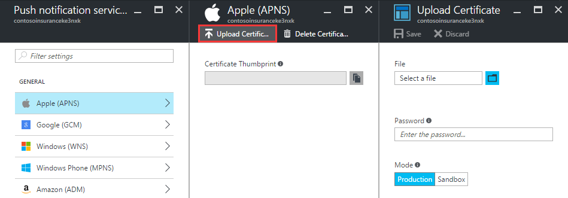

     > **Note**: Make sure to select **Sandbox** if you created a development push certificate for development and testing. 	Otherwise, choose **Production**.

   - Click **Save**.


**Initialize the Storage Account**

1. Get the name and key of the Storage Account.

   
   ​	
   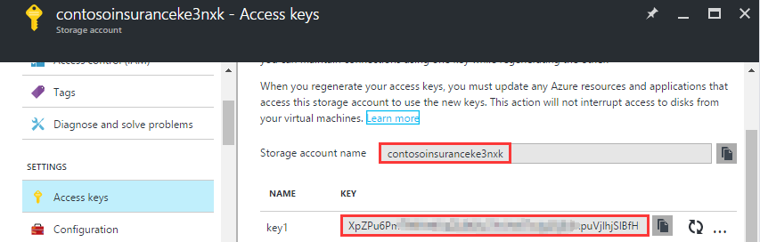

2. Execute the **src/Cloud/InitStorage.ps1** PowerShell script. 

   >**Note:** The PowerShell below will create necessary blob containers and queues.
   > Please Use the *Storage Account Name* and *Storage Account Key* associated with your Storage Account.

   ```PowerShell
   ./InitStorage.ps1 <<Your Storage Account Name>> <<Your Storage Account Key>>
   ```

## Create Customer User Accounts ##

The customer user accounts used to sign into the mobile app are Microsoft Accounts.  Each time you sign into the mobile app, the system checks to see if you have previously signed in with the Microsoft Account and proceeds like this:

- If you **have not** signed in to the mobile app with the Microsoft Account before, the system creates records in the SQL databases associated with the account and uploads the customers sample vehicle images to blob storage.  Then, the mobile app displays the vehicles page in the mobile app.
- If you **have** signed in with the Microsoft Account before, the mobile app loads the vehicles page in the mobile app.

  >**Note:**  The following app setting in the api web app's web.config file controls if data is auto seeded for new users.  If you do not want to auto seed data for new users set this value to false.
  >
  >```xml
  > <add key="AutoSeedUserData" value="true"/>
  >```
  > If you change this app setting vale after you deploy the web api app and you deploy again with the ARM template then you will have to manually change it again.

## How To: Run the mobile client app for local execution and debugging on the iOS simulator##

>**Note:** Currently, only the iOS version of the mobile app is fully implemented.  The Android version of the app is a prototype and is not fully implemented. 

1. Use Visual Studio 2015 to open the **src/Cloud/ContosoInsurance-Mobile.sln** Visual Studio Solution file.
   1.Set up your Mac computer to act as a remote build machine.
   1.	Click the **Tools** menu and select **Options**.
       1.Click **Xamarin**.
       1.Click **iOS Settings**.
       1.Click **Find Xamarin Mac Agent** and follow the wizard to connect your Mac.
       1.Click **OK**.
2. Configure the debugging target device according to the screenshot below.

   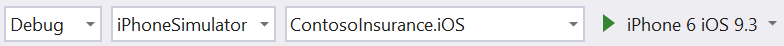
3. Press **F5**.
4. Observe the iOS Simulator start on the Mac Agent and load the Contoso Insurance mobile app.

> **Note:** If you do not set a location for the mobile ap it will fail with an exception.

1.  In the Simulator menu, click **Debug**, **Location**, **Custom Location**.

    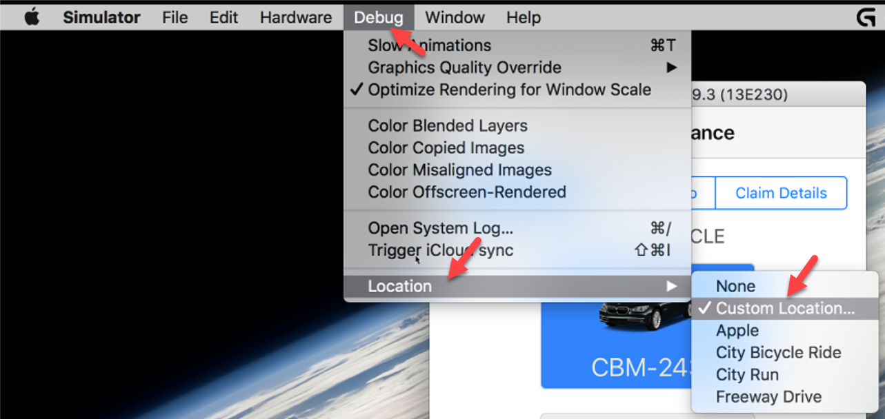

    1.Enter a **latitude** and **longitude**.
    2.Click **OK**.

## How To: Integrate Hockey App with the Xamarin App for deployment and logging ##

### Integrate Hockey App with the Xamarin App to iOS ###
1. Open the [Hockeyapp](https://www.hockeyapp.net/ "Hockeyapp") site, if you have not already created a Hockey App developer account, please sign up.

    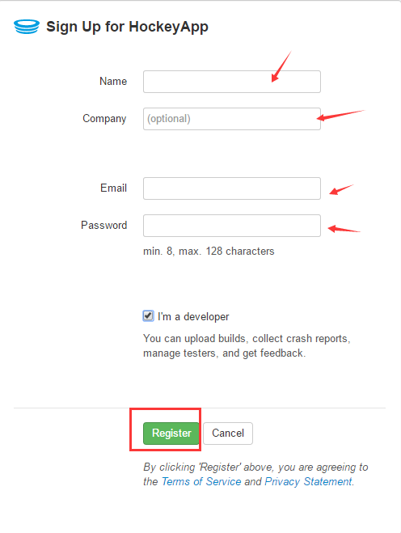

2. Log in to Hockey App using the developer user that you registered above, and go to the [Hockey App dashboard](https://rink.hockeyapp.net/manage/dashboard "Hockey App dashboard").

3. Click the **New App** button.

    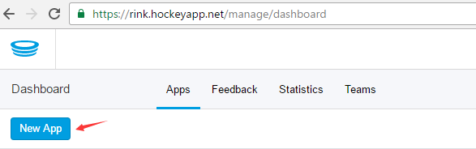

4. Click the create the App **manually** instead link.

    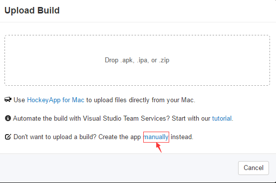

5. Enter your app information and click the **Save** button.

   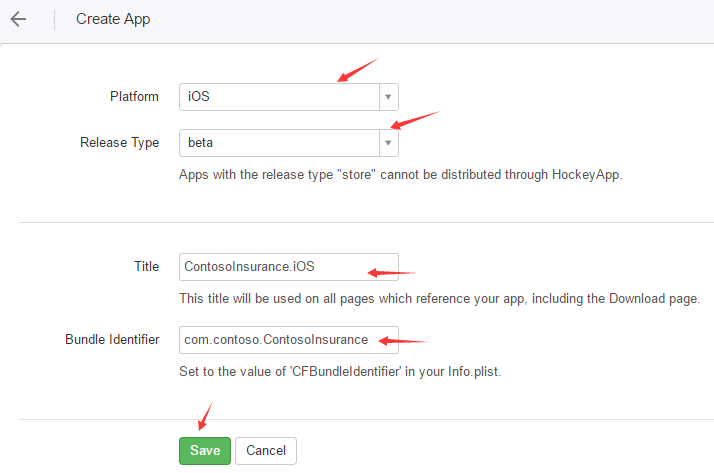

6. Copy the **App Id**, you will use it later.
   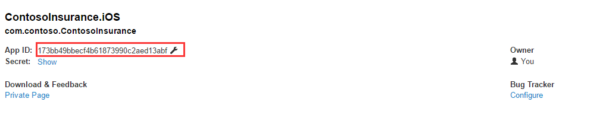

7. Use Visual Studio 2015 to open the **ContosoInsurance-Mobile.sln** Visual Studio Solution.

8. Build the iOS project, and upload your iOS **.ipa** file to the iOS Hockey App that you created above.

   > **Note:** Be sure that tester's iOS UDID has been included in your Apple provision file before build.

    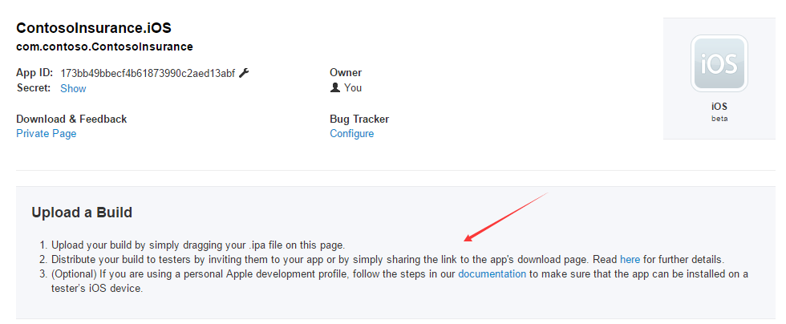

9. Enter the release notes for the build, then click **Next Step**

   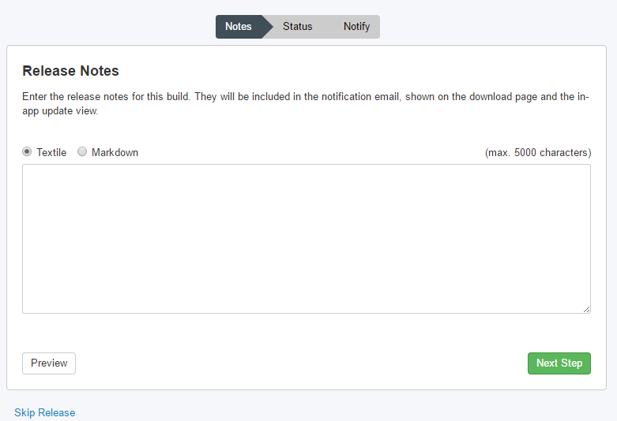

10.  Configure the **Status** according to the screen shot below, then click **Next Step**.

    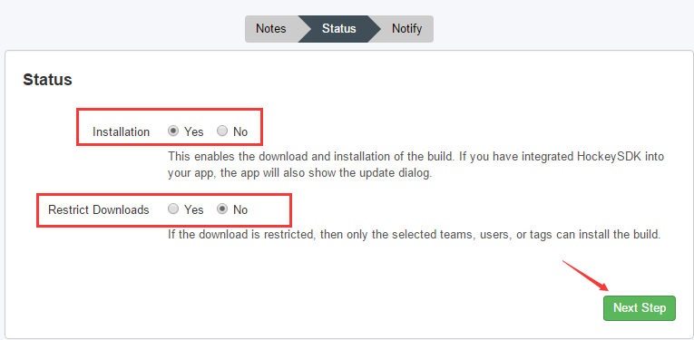

11.  Configure **Notify** according to the screen shot below, then click **Send**.

   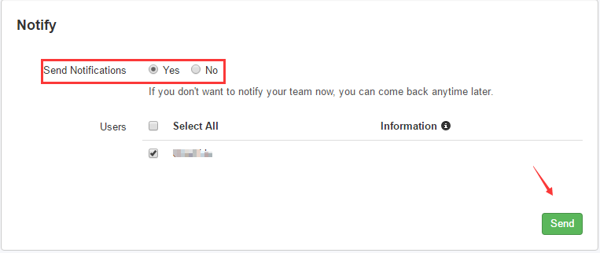

12.  The confirmation screen will look like this after you have uploaded the file and configured the App successfully.

    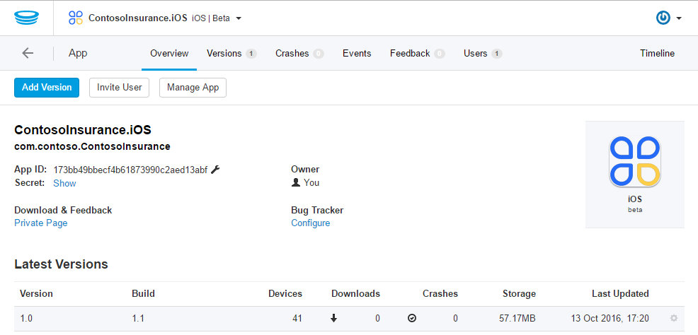

13.  Click the **Invite User** button to invite a test user to test the App.

    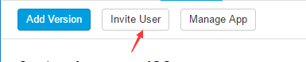

14.  Enter the tester's email address and click **Save**.

    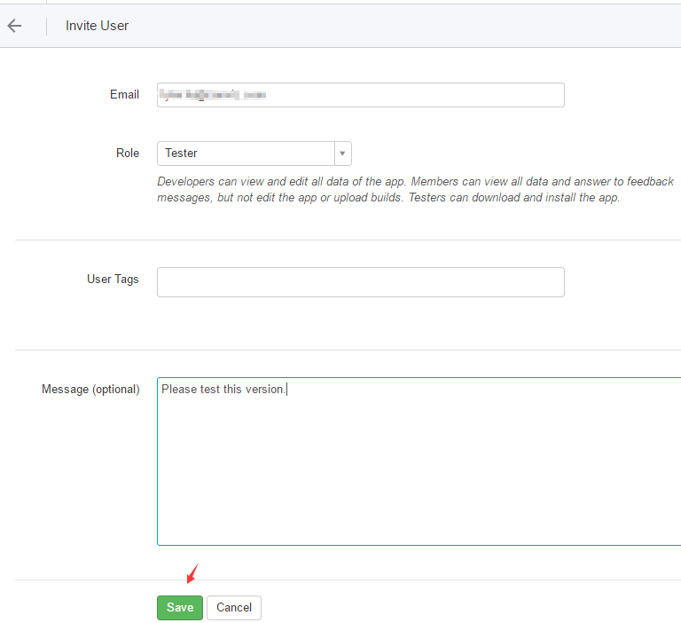

### Integrate Hockey App with the Xamarin App to Android ###
1. Log in to Hockey App using the developer user that you registered above, and go to the [Hockey App dashboard](https://rink.hockeyapp.net/manage/dashboard "Hockey App dashboard").
2. Click the **New App** button.

    

3. Click the create the App **manually** instead link.

    

4. Enter your app information and click the **Save** button.

   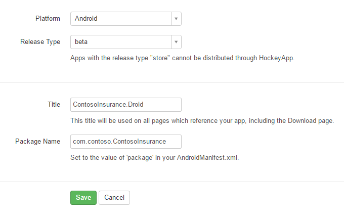

5. Copy the **App Id**, you will use it later.

   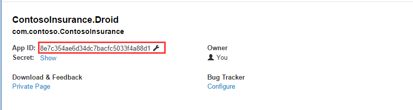

6. Use Visual Studio 2015 to open the **ContosoInsurance-Mobile.sln** Visual Studio Solution.

7. Build the Android project, and upload the Android **.apk** file to the Android Hockey App that you created above.

    

8. Enter the release notes for the build, then click **Next Step**

   

9. Configure the **Status** according to the screen shot below, then click **Next Step**.

    

10. Configure **Notify** according to the screen shot below, then click **Send**.

   

11. The confirmation screen will look like this after you have uploaded the file and configured the App successfully.

    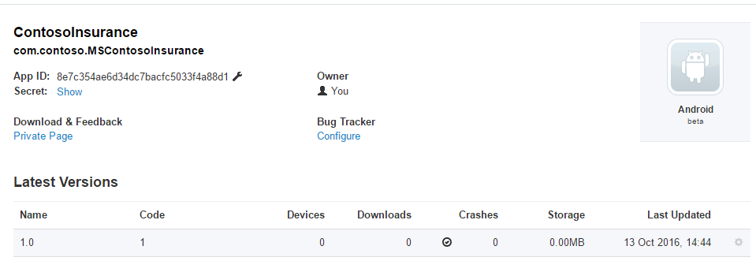

12. Click the **Invite User** button to invite a test user to test the App.

    

13.  Enter the tester's email address and click **Save**.

    

### Download the iOS Hockey App to an iOS device and test it ###
1. Open the [Hockey App dashboard](https://rink.hockeyapp.net/manage/dashboard "Hockey App dashboard"), and log into Hockey App using the tester user you sent the email to.
2. Open the **ContosoInsurance.iOS** Hockey App, and Click **Download**.

    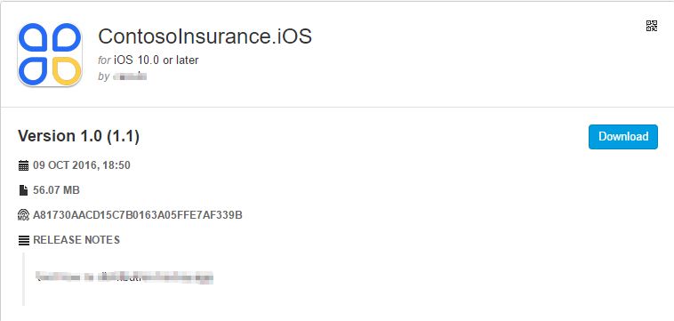

3. **Install** the app with iTunes.

   > **Note:** Be sure that your device UDID has been included in your Apple provision file.

4. Open the **Settings** page and enter the iOS App Id that you copied above.

	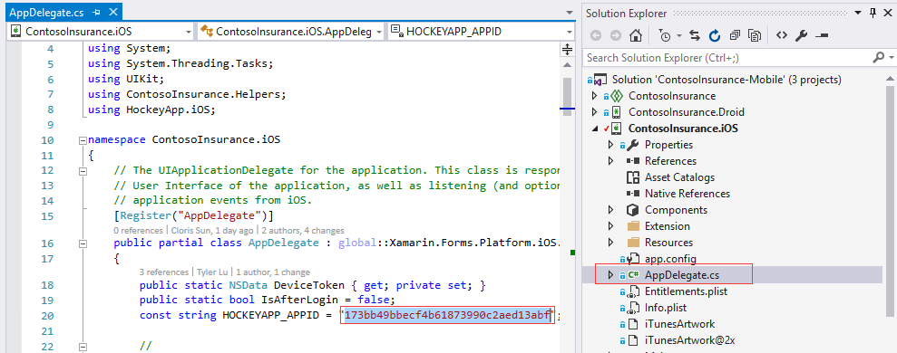

5. Touch the **Save** button, and **restart** the app. 
	
   > **Note:** You must restart the App to enable the new Hockey App Id after saving the configuration value.

6. Test.

### Download the Android Hockey App to an Android device and test it ###
1. Open the [Hockey App dashboard](https://rink.hockeyapp.net/manage/dashboard "Hockey App dashboard"), and log into Hockey App using the tester user you sent the email to.
2. Open the **ContosoInsurance.Droid** Hockey App, and Click **Download**.

    

3. Copy the .apk file to your Android device and install it.

4. Open the **Settings** page and enter the Android App Id that you copied above.

	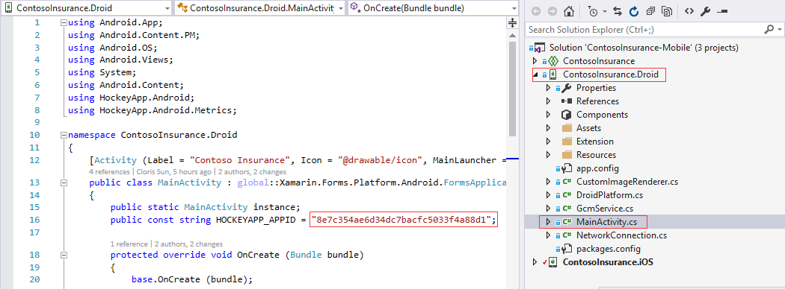

5. Touch the **Save** button, and **restart** the app. 
	
   > **Note:** You must restart the App to enable the new Hockey App Id after saving the configuration value.

6. Test.

### Explore Hockey App Crashes/Events ###
1. Open the [Hockey App dashboard](https://rink.hockeyapp.net/manage/dashboard "Hockey App dashboard"), and log into Hockey App using the developer user that you created above.
2. Open the Hockey App you wish to explore and the click **Crashes/Events** tab to see the logs.

    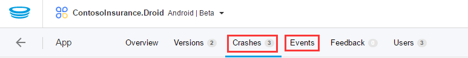

3. You can explore HockeyApp data in Application Insights!  To do this follow the steps in this [link](https://azure.microsoft.com/en-us/documentation/articles/app-insights-hockeyapp-bridge-app/ "Exploring HockeyApp data in Application Insights") to configure the Hockey App Bridge to Application Insights.

    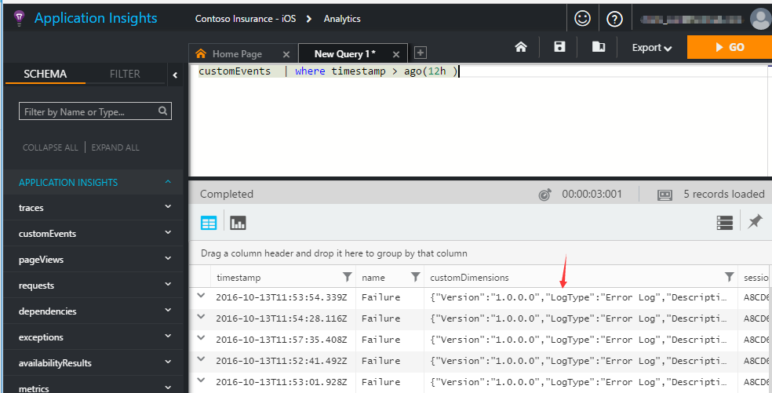

## How To: Install the web application for local execution and debugging ##

1. Use Visual Studio 2015 to open the **src/Cloud/ContosoInsurance-Cloud.sln** Visual Studio Solution file.
2. Right click the **ContosoInsurance.Web** project and select **Set as StartUp Project**.  
3. Press **F5**.
4. Observe the web browser open and load the Contoso Insurance claims search page.

## How To: View the custom events and metrics in Application Insights to monitor and debug the application

The sample logs status information and exceptions to Application Insights for every step in the process.  This starts moment they are received from the mobile app and continues until the very end when a claim is manually approved or rejected by the claims adjuster.

To view the custom events and metrics in Application Insights follow these steps.

1. Open https://portal.azure.com in a web browser and log in.
2. Click the **Application Insights** link in the left menu.
3. Click the **contosoinsurance** Application Insights application that was created when you deployed all the components.
4. Click **Search**.

    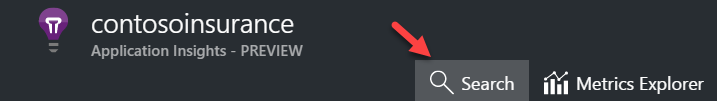

5. Observe all of the Custom Events.

    

6. Click a Custom Event in the list to see the metrics logged for the event.

    >**Note:**  You can refer to the Application Insights Logging Matrix in the [Azure Components document](/Azure Components.docx) to see all of the Custom Metrics logged for each Custom Event.  In the example below you can see this custom event was written by the HandleNewClaim Azure Function when it invoked the ClaimAutoApprover Azure Function.

    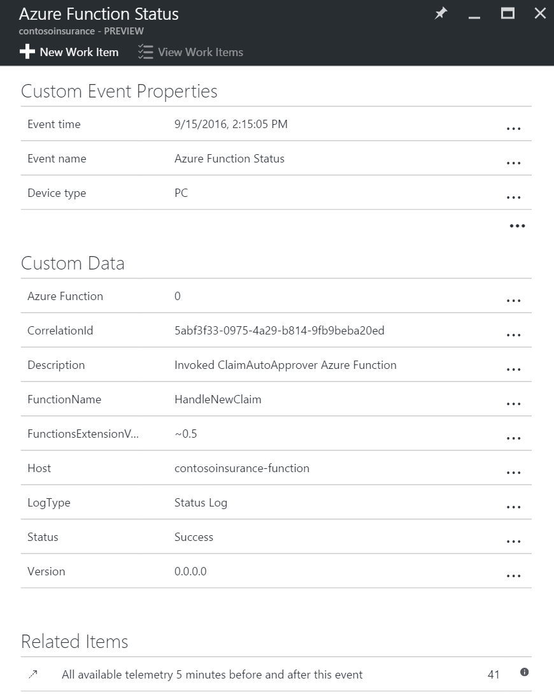

**Track an individual claim**

Each claim has a CorrelationId associated with it.  You can see this in the screenshot above.  The CorrelationId is used to track the claims from the moment they are received from the mobile app until the end of the process.  You can track the flow of a single claim through the Azure components and the web application by using the CorrelationId.  Here's how to do it:

1. Copy the CorrelationId from a Custom Event.
2. Click **Search**.

        

3. Paste the CorrelationId into the **Search textbox** and observe all the Custom Events associated with the CorrelationId.

        >**Note:**  This is an excellent way to debug errors in the system and is also especially helpful to determine how long a given step takes to execute.  This sample typically processes claims from the point where they are submitted in the mobile app to the point where they are ready for manual approval in 15 seconds when running the sample on the most basic App Services service level!

        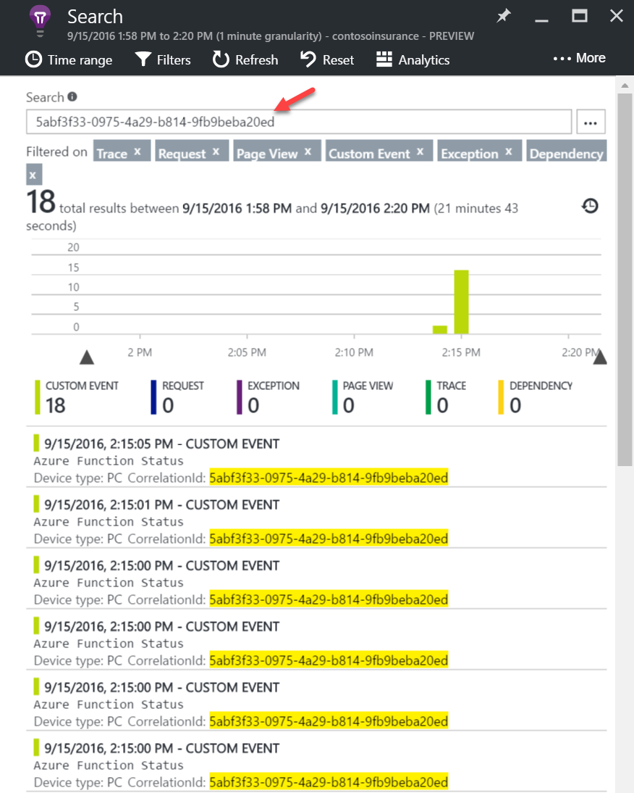 

**Track an individual claim with Application Insights Analytics**

In addition to viewing all the Custom Events associated with a CorrelationId in the Application Insights Search interface, you can use Application Insights Analytics to track an individual claim.

Here is the query to run in Application Insights Analytics to track an individual claim's CorrelationId.

```
customEvents
    | where customDimensions.CorrelationId =~ "<YOUR CORRELATION ID>"
    | project timestamp, customDimensions.LogType, name, customMeasurements, customMeasurements.Host, customDimensions.Description, customDimensions.FunctionName, customDimensions.Status, customDimensions.Version
| order by timestamp asc
```
As you can see below, this claim took 22 seconds to process.

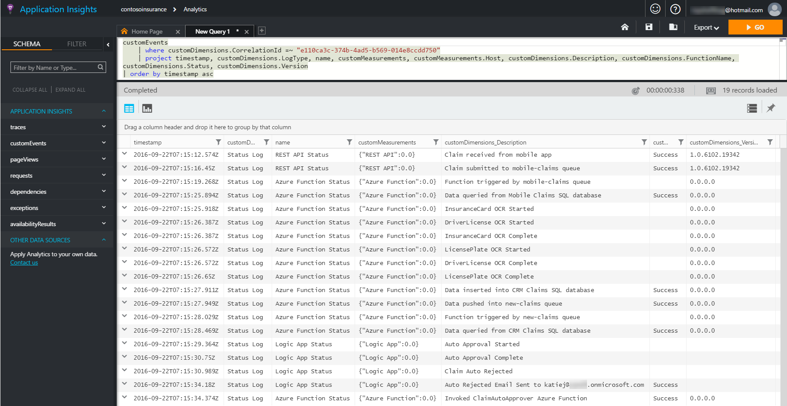

## How To: Wipe all claims ##

As you use the demo, many claims will accumulate in the databases and in the blob storage container.  To wipe the claims and reset the demo, perform the the following steps:

1. Open the Web App in a web browser and log in.

   

2. Click the **username** at the top right of the page:

   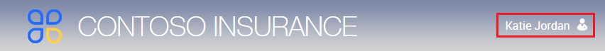

3. Click **Wipe Claims**.

   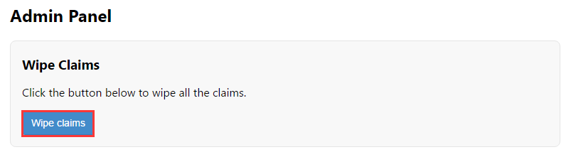

## Contributors
| Roles                                    | Author(s)                                |
| ---------------------------------------- | ---------------------------------------- |
| Project Lead / Architect / Documentation | Todd Baginski (Microsoft MVP, Canviz Consulting) @tbag |
| Mobile Apps                              | Cloris Sun (Canviz Consulting)           |
| Web Apps                                 | Albert Xie (Canviz Consulting)           |
| Azure Components, Services, Deployment   | Tyler Lu (Canviz Consulting) @TylerLu    |
| Testing                                  | Ring Li (Canviz Consulting)              |
| Testing                                  | Melody She (Canviz Consulting)           |
| UX Design                                | Justin So (Canviz Consulting)            |
| PM                                       | Johnny Chu (Canviz Consulting) @johnathanchu |
| PM                                       | Arthur Zheng (Canviz Consulting)         |
| Sponsor / Support                        | Donna Malayeri (Microsoft) @lindydonna   |
| Sponsor / Support                        | Cory Fowler (Microsoft) @SyntaxC4-MSFT   |
| Sponsor / Support                        | Jeremy Thake (Microsoft) @jthake         |
| Sponsor / Support                        | Jeff Hollan (Microsoft) @jeffhollan      |
| Sponsor / Support                        | Yochay Kiriaty (Microsoft) @yochay       |
| Sponsor / Support                        | Fabio Kavalcante (Microsoft)             |
| Sponsor / Support                        | Chris Gillum (Microsoft) @cgillum        |

## Version history

| Version | Date          | Comments        |
| ------- | ------------- | --------------- |
| 1.0     | Sept 26, 2016 | Initial release |

## Disclaimer
**THIS CODE IS PROVIDED *AS IS* WITHOUT WARRANTY OF ANY KIND, EITHER EXPRESS OR IMPLIED, INCLUDING ANY IMPLIED WARRANTIES OF FITNESS FOR A PARTICULAR PURPOSE, MERCHANTABILITY, OR NON-INFRINGEMENT.**
